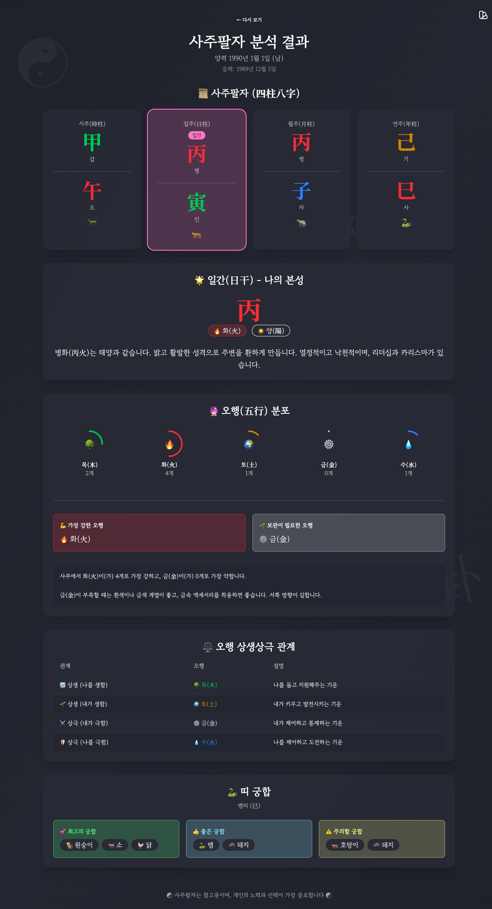

# 사주팔자 (四柱八字) 🔮

생년월일시로 알아보는 나의 사주팔자 분석 프로그램




## 기능

- 📅 **양력/음력 입력 지원**: 양력 또는 음력으로 생년월일 입력 가능
- 🕐 **시주(時柱) 계산**: 12지지 시간대 선택으로 정확한 사주 계산
- ☯ **사주팔자 분석**: 연주, 월주, 일주, 시주의 천간/지지 표시
- 🌟 **일간(日干) 해석**: 본인의 성격과 특성 분석
- 🔮 **오행(五行) 분포**: 목, 화, 토, 금, 수의 분포 시각화
- ⚖️ **상생상극 관계**: 오행 간의 상생상극 관계 설명
- 🐲 **띠 궁합**: 12지지 띠별 궁합 정보

## 기술 스택

- **프레임워크**: [SvelteKit](https://kit.svelte.dev/) + Svelte 5
- **상태 관리**: Svelte Stores (writable, derived)
- **스타일링**: [Tailwind CSS](https://tailwindcss.com/) + [DaisyUI](https://daisyui.com/)
- **음력 변환**: [lunar-javascript](https://www.npmjs.com/package/lunar-javascript)
- **패키지 매니저**: pnpm
- **언어**: TypeScript

## 설치 및 실행

```bash
# 의존성 설치
pnpm install

# 개발 서버 실행
pnpm dev

# 프로덕션 빌드
pnpm build

# 프로덕션 미리보기
pnpm preview
```

## 프로젝트 구조

```
src/
├── app.css              # 전역 스타일 (Tailwind, DaisyUI)
├── app.html             # HTML 템플릿
├── lib/
│   ├── saju.ts          # 사주 계산 로직
│   └── stores.ts        # Svelte stores (상태 관리)
└── routes/
    ├── +layout.svelte   # 레이아웃 (테마 전환 등)
    └── +page.svelte     # 메인 페이지 (입력폼, 결과)
```

## 테마

DaisyUI 테마를 지원합니다. 우상단 버튼으로 테마를 변경할 수 있습니다:
- Dracula (기본)
- Cupcake
- Synthwave  
- Night

## 참고

⚠️ 사주팔자는 참고용이며, 개인의 노력과 선택이 가장 중요합니다.

## 라이선스

MIT License
